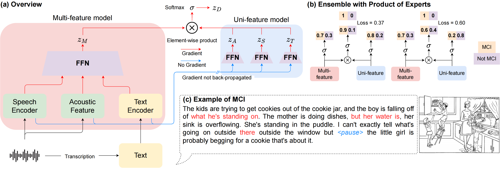

# CogniVoice: Multimodal and Multilingual Fusion Networks for Mild Cognitive Impairment Assessment from Spontaneous Speech

#### INTERSPEECH 2024, [Paper]()

#### Authors: 
- [Jiali Cheng]() (jiali_cheng@uml.edu)
- [Mohamed Elgaar](https://mohdelgaar.github.io/) (mohamed_elgaar@uml.com)
- [Nidhi Vakil]() (nidhipiyush_vakil@uml.edu)
- [Hadi Amiri](https://www.cs.uml.edu/~hadi/index.html) (hadi_amiri@uml.edu)


<p align="center">
    
</p>


## Key idea of CogniVoice

Given an input speech sample, we extract features using transformers for speech and its corresponding text as well as acoustic features obtained from DisVoice. A standard training approach concatenates all features and optimizes the cross-entropy loss. To model potential shortcut signals within each feature sets, we propose to train with PoE, applied to the multi-feature model and several uni-feature models, which predict the labels using only one set of features separately. Our approach obtain ensemble logits using the multi-feature and uni-feature models, see element-wsie product. 

In addition, we show how PoE can reduce the loss for samples correctly predicted using both multimodal and unimodal inputs, and increase the loss for samples that cannot be accurately predicted using one of the modalities, which allows for identifying and mitigating weaknesses in the model's predictive capabilities. Therefore, the resulting ensemble logits can account for the spurious correlations in the dataset, while also being regularized to mitigate overfitting. 


## Datasets

We use the TAUKADIAL 2024 challenge dataset. Please download the dataset from [Link](https://taukadial-luzs-69e3bf4b9878b99a6f03aea43776344580b77b9fe54725f4.gitlab.io/)


## Requirements

CogniVoice has been tested using Python >=3.6 and `transformers>=4.25`.


## Running the code

Due to the limited data size, we use k-fold cross-validation and report the average validation performance.

**To run MCI detection (classification)**

```bash
bash run_cls.sh
```

**To run MMSE prediction (regression)**

```bash
bash run_reg.sh
```

Some important arguments are
```
--poe: whether to use Product of Experts (PoE)

--poe_alpha: alpha to control debiasing strength in PoE
```

All Huggingface TrainingArguments can be passed in.


## Citation

If you find *CogniVoice* useful for your research, please consider citing this paper:

```
@inproceedings{cheng24c_interspeech,
  title     = {CogniVoice: Multimodal and Multilingual Fusion Networks for Mild Cognitive Impairment Assessment from Spontaneous Speech},
  author    = {Jiali Cheng and Mohamed Elgaar and Nidhi Vakil and Hadi Amiri},
  year      = {2024},
  booktitle = {Interspeech 2024},
  pages     = {4308--4312},
  doi       = {10.21437/Interspeech.2024-2370},
}
```


## Miscellaneous

Please send any questions you might have about the code and/or the algorithm to <jiali_cheng@uml.edu>. 


## License

CogniVoice codebase is released under the MIT license.
